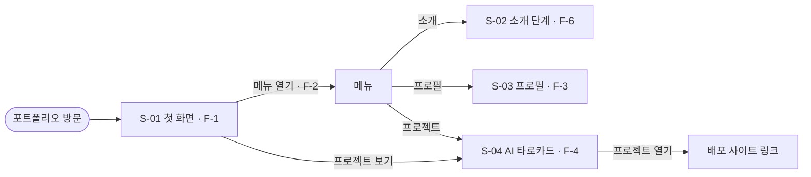
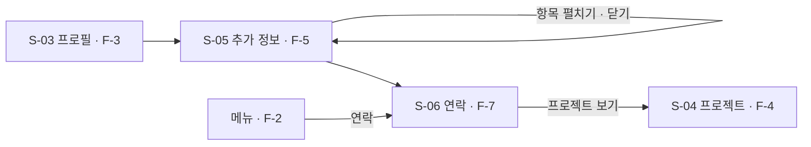

# 웹 포트폴리오 유저플로우

## 소개 · 프로젝트 보기 (시나리오 1 · 2)

```mermaid
flowchart LR
    IN(["포트폴리오 방문"]) --> S1["S-01 첫 화면 · F-1"]
    S1 -->|메뉴 열기 · F-2| NAV["메뉴"]
    NAV -->|소개| S2["S-02 소개 단계 · F-6"]
    NAV -->|프로필| S3["S-03 프로필 · F-3"]
    NAV -->|프로젝트| S4["S-04 AI 타로카드 · F-4"]
    S1 -->|프로젝트 보기| S4
    S4 -->|프로젝트 열기| EXT["배포 사이트 링크"]
```

## 추가 정보 · 연락 (시나리오 3)

```mermaid
flowchart LR
    S3["S-03 프로필 · F-3"] --> S5["S-05 추가 정보 · F-5"]
    S5 -->|항목 펼치기 · 닫기| S5
    S5 --> S6["S-06 연락 · F-7"]
    NAV["메뉴 · F-2"] -->|연락| S6
    S6 -->|프로젝트 보기| S4["S-04 프로젝트 · F-4"]
```

- 연락처와 이력은 자료 확인 전까지 `[확인 필요]`로 표시한다.
